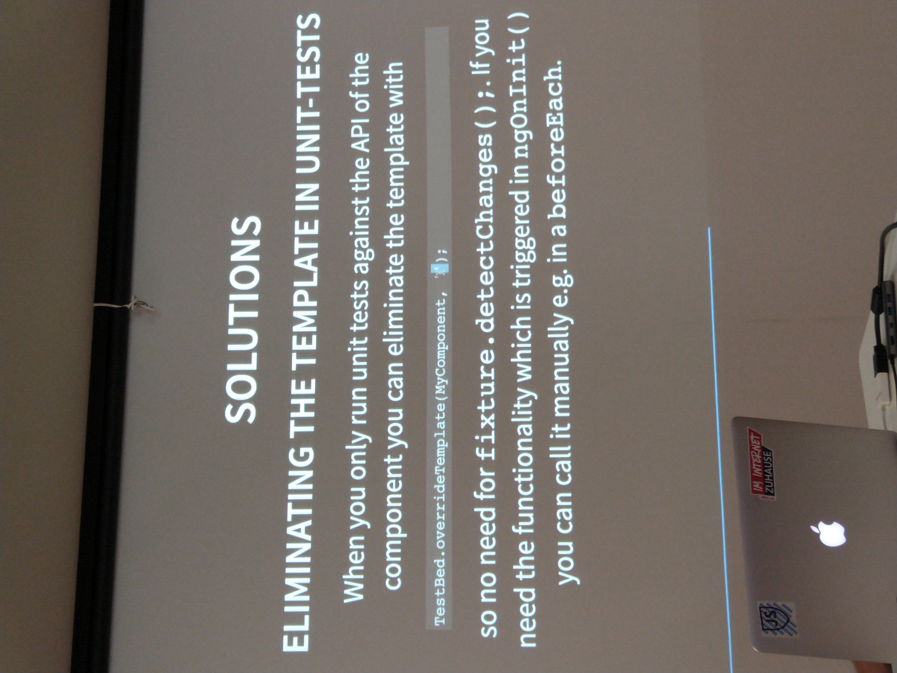
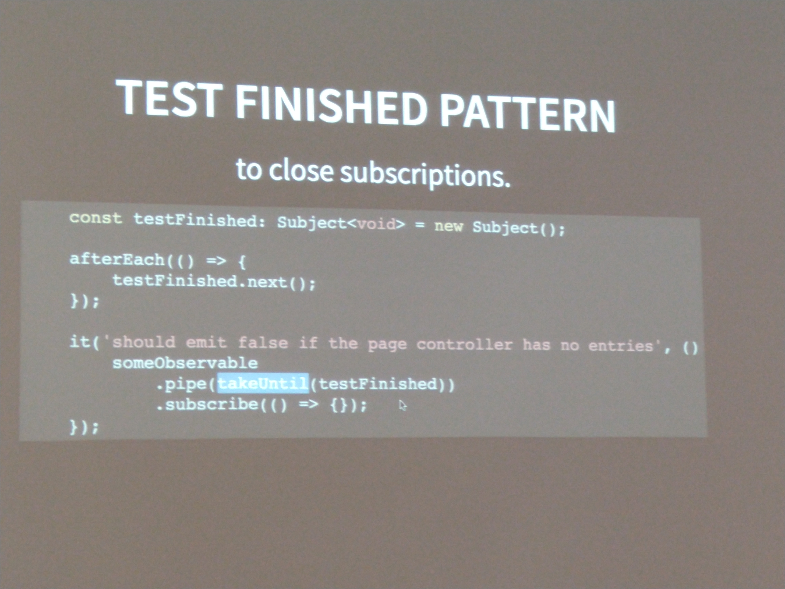

# Testing Angular at Hetzner

## jasmine vs jest 
* jasmine and karma come out of the box and are easy to use
* but they are slow and have a lot of overhead
* karma can run against multiple browsers

* Jest only compiles what is needed
* no endless startup time for jest
* can run tests in parallel
* snapshot test can be very helpful for component tests -> match snapshots for the html
* but the snapshots are often hard to maintain. Especially with larger component it might not be useful. So good for "lazy tests" but nothing complex
* proposed alternative to snapshots from the audience: enzyme
* angular support: jest-preset-angular
* migrating tool: jest-codemods
* *but* : spying system is different
* hetzner developed jasmine polyfill but sadly not open source yet.
* this polyfill allows running the jest tests with karma as well
* snapshot tests can *not* run in the karma test suite

## testing bottlenecks
* the default test bed setup resets for each test (each `it`)
* `fixture.detectchanges()` costs time

### solutions
* limit the usage of `fixture.detectchanges()` to only after everything is set up
* don't import modules, declare components
* eliminate template in unit tests 
* 
* `ngx-prepare-test-environment` -> on npm
* find slow tests manually. There might individual tests that slow your whole suite down.

## pitfalls
* jest swallows async thrown exceptions which then show up in karma later on
* browser animations and snapshot tests -> angular animation magic has strange side effects on other components
* `.tothrow` does not do a deep equal
* not all browser Api's are available in the virtual Dom which you then have to mock for snapshot test

## more tips
* write your own schematics to set up tests 
* 
* don't forget e2e: also see hetznercloud npm